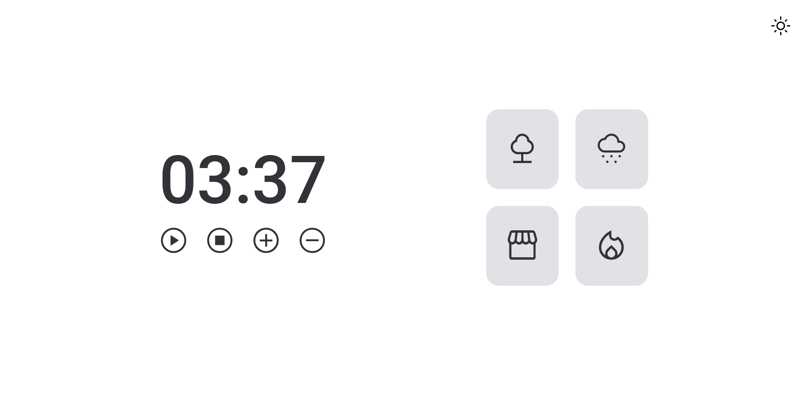
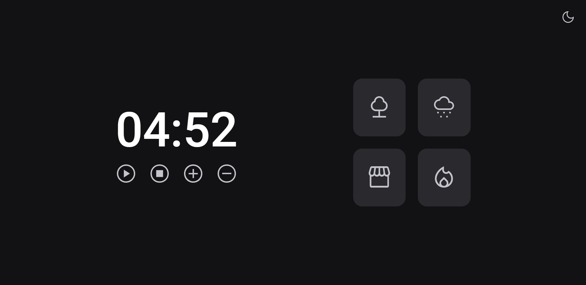

# Projeto Focus Timer 2.0 | Trilha Explorer

---

## Tecnologias

  

---

## O que aprendi

- Aprimorar o aprendizado no HTML e CSS
- Entender melhor o uso do MODULES no JavaScript
- Fazer mudança de LightMode para DarkMode
- Adiconar sons na aplicação
- Melhorar a lógica do if, else
- Recorrer a ajuda na comunidade do Discord

---

## Contato

<a href = "mailto:probertos717@gmail.com">